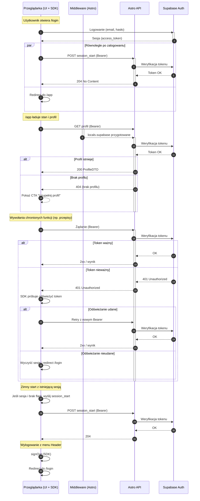

<authentication_analysis>
- Przepływy autentykacji (wg PRD i spec):
  - Logowanie: formularz → Supabase Auth (signIn) → sesja (access_token) →
    event `session_start` → redirect do `/app`.
  - Rejestracja: formularz → Supabase Auth (signUp) → (opcjonalnie)
    weryfikacja e‑mail → sesja → `session_start` → `/app`.
  - Zimny start: istniejąca sesja w SDK → `session_start` 1× (best‑effort).
  - Wylogowanie: Header → signOut → redirect do `/login`.
  - Wywołania API: `Authorization: Bearer <token>` w każdym żądaniu.
  - Weryfikacja tokenu: po stronie Astro API z Supabase Auth; RLS w DB.
  - Wygasanie tokenu: SDK odświeża; przy 401 próbujemy odświeżenie i retry;
    w razie niepowodzenia redirect do `/login`.
- Aktorzy i interakcje:
  - Przeglądarka (UI + SDK), Middleware (locals.supabase), Astro API, Supabase
    Auth (weryfikacja). DB z RLS w tle (bezpośrednio za API).
- Weryfikacja/odświeżanie tokenów:
  - Weryfikacja w Astro API (nagłówek Bearer). Odświeżanie w SDK (przeglądarka)
    transparentnie; na 401 ścieżka retry lub redirect.
- Kroki (skrót): logowanie/rejestracja → sesja → `session_start` → `/app` →
  wywołania API z Bearer → weryfikacja tokenu → odpowiedź lub 401 → refresh
  w SDK → retry lub redirect.
</authentication_analysis>

<mermaid_diagram>

</mermaid_diagram>

