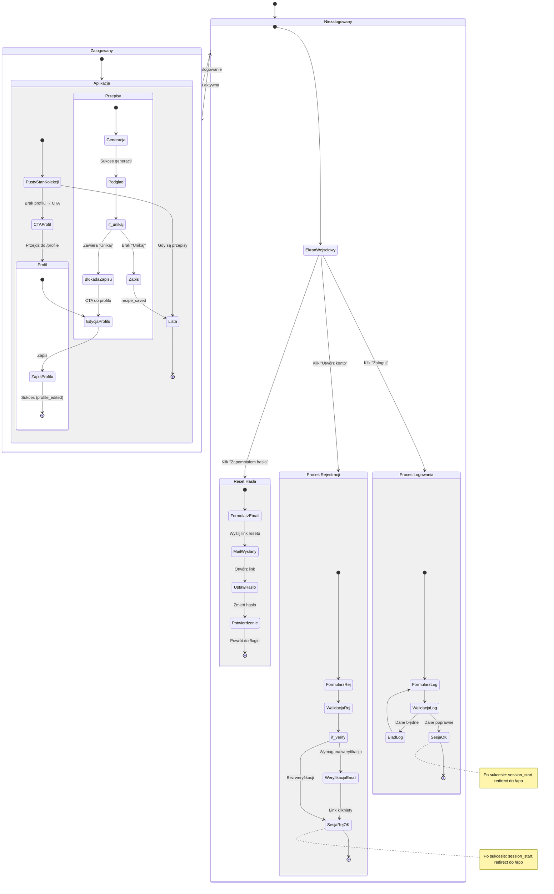

<user_journey_analysis>
- Ścieżki użytkownika (wg PRD i spec auth):
  - Start niezalogowany → przejście do /login.
  - Rejestracja → (opcjonalna) weryfikacja e‑mail → zalogowany.
  - Logowanie → zalogowany.
  - Zapomniane hasło → e‑mail → reset → powrót do /login.
  - Zalogowany → /app (pusty stan kolekcji). Jeśli brak profilu, CTA do
    uzupełnienia → /profile → zapis profilu.
  - Dostęp do głównej funkcjonalności (generacja, zapis, lista) tylko po
    zalogowaniu (RLS po stronie serwera).
  - 401 w trakcie pracy → powrót do /login.
- Główne stany: Niezalogowany, Logowanie, Rejestracja, Reset Hasła,
  Zalogowany (/app), Edycja Profilu (/profile).
- Punkty decyzyjne: Czy konto wymaga weryfikacji e‑mail? Czy profil istnieje?
  Czy generowany przepis zawiera składniki z „Unikaj”? (blokada zapisu).
- Cel stanów: umożliwić bezpieczne wejście do aplikacji i korzystanie z
  funkcji po zalogowaniu, zgodnie z US‑001 i resztą US.
</user_journey_analysis>

<mermaid_diagram>

</mermaid_diagram>

