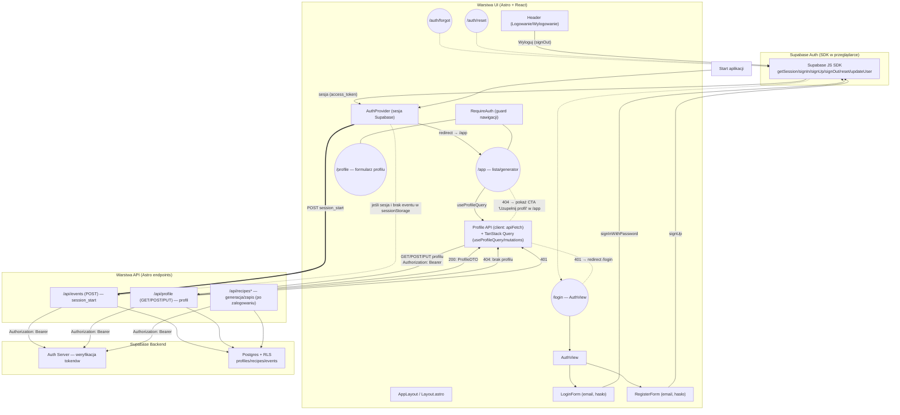

<architecture_analysis>
- Kluczowe pliki i elementy biorące udział w autentykacji:
  - Klient Supabase: src/db/supabase.client.ts:1 — inicjalizacja SDK Supabase dla frontendu.
  - Middleware Astro: src/middleware/index.ts:1 — przekazuje klienta Supabase do locals (dla SSR, choć endpointy auth używają klienta z Bearer).
  - API klient profilu (frontend): src/lib/api/profile.ts:1 — wrapper `apiFetch` dodający `Authorization: Bearer <token>`, hooki TanStack Query do GET/POST/PUT profilu, redirect na 401.
  - Endpointy wymagające Bearer:
    - Profil: src/pages/api/profile/index.ts:1 — GET/POST/PUT, weryfikacja `Authorization`, tworzy klienta Supabase z nagłówkiem Bearer, RLS.
    - Zdarzenia: src/pages/api/events.ts:1 — POST, wymaga Bearer, loguje `session_start` (best‑effort).
    - Przepisy: src/pages/api/recipes/*.ts:1 — również wymagają Bearer (generowanie/zapis), istotne po zalogowaniu.
  - Typy/kontrakty: src/types.ts:1 — DTO i typy domeny, w tym Auth DTO (rejestracja/logowanie) i ApiError.
- Główne strony i komponenty (wg spec auth):
  - `/login` (LoginPage) — `AuthView` z `LoginForm` i `RegisterForm`.
  - `/auth/forgot` — `ForgotPasswordView`.
  - `/auth/reset` — `ResetPasswordView` + `NewPasswordForm`.
  - `/app` — AppPage (po zalogowaniu; pusty stan kolekcji); wyświetla CTA do `/profile` jeśli profil nie istnieje.
  - `/profile` — ProfilePage (edycja dietType?, dislikedIngredients[], preferredCuisines[]).
  - `Header` — menu użytkownika (Wyloguj/Log in).
  - `AuthProvider` + `RequireAuth` — zarządzanie sesją i guardy nawigacji (klientowo).
  - `Profile API (client)` + `TanStack Query` — pobieranie/zapis profilu z Bearer.
- Przepływ danych:
  - Logowanie/Rejestracja → Supabase Auth (SDK) → sesja z `access_token` → klientowe wywołania API z `Authorization: Bearer` → endpointy Astro weryfikują token i używają Supabase z RLS → Postgres.
  - Po zalogowaniu i przy „zimnym starcie” z istniejącą sesją wysyłamy `POST /api/events` z `session_start` (best‑effort).
  - `/app` używa `useProfileQuery` do `GET /api/profile`; 404 → CTA do `/profile`, 401 → redirect `/login`.
- Krótki opis funkcjonalności komponentów:
  - AuthView/LoginForm/RegisterForm — formularze, walidacja, wywołania `supabase.auth.signInWithPassword/signUp`.
  - Forgot/Reset — `resetPasswordForEmail` i `updateUser({ password })` na SDK.
  - AuthProvider — hydratuje sesję z Supabase, publikuje `session`, loguje `session_start` (raz na start sesji przeglądarki).
  - Profile API (client) — pobiera token z SDK, dodaje Bearer, obsługuje 401/404, integruje z TanStack Query.
  - Astro API (profile/events/recipes) — weryfikuje Bearer, tworzy klienta Supabase „w imieniu” użytkownika, egzekwuje RLS.
</architecture_analysis>

<mermaid_diagram>

</mermaid_diagram>

